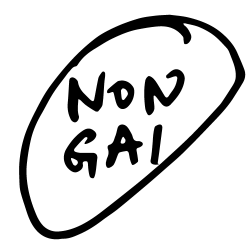
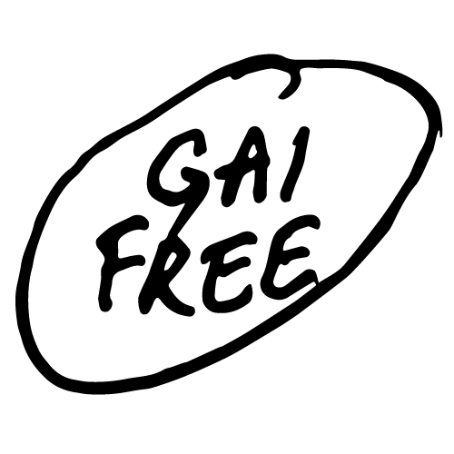
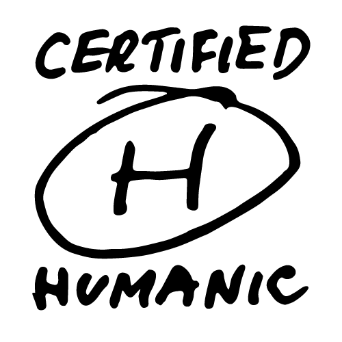
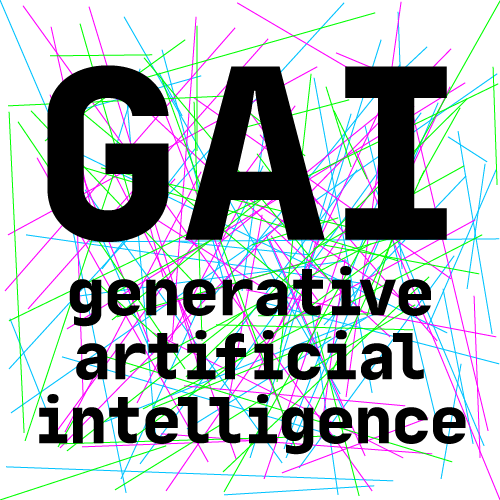

# Generative AI Labels

Not a standard, but recommendation.

|Non-GAI |GAI Free |Humanic |GAI |
|---|---|---|---|
|Meaning: 99%+ made by human| 90%+| 50%+| Mostly done by Generative AI|
|Similar to: Non-GMO| GMO Free| Organic| GMO| 

Explanation:  
1. First three of these labels made by human. 
2. Random lines in GAI label was made mostly by Generative AI.
3. Effectively, 75% of project was made by human, so the project is labeled as **GAI Free**.

———————————  

  
  
  

